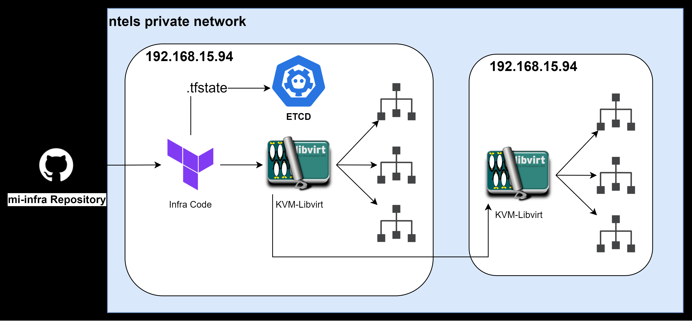

# mi-infra

## Overview
Host OS : Rocky Linux release 8.6 (Green Obsidian)


## etcd configuration

Version : 3.4.16

[서비스 구성]
- /etc/systemd/system/etcd.service
```
[Unit]
[Service]
User=root
PermissionsStartOnly=true
EnvironmentFile=-/etc/etcd.env
ExecStart=/usr/local/bin/etcd -initial-advertise-peer-urls http://192.168.15.94:2380 -listen-peer-urls http://0.0.0.0:2380 -advertise-client-urls http://192.168.15.94:2379 --listen-client-urls http://0.0.0.0:2379 -initial-cluster etcd1=http://192.168.15.94:2380
Restart=always
RestartSec=15s
TimeoutStartSec=30s
[Install]
WantedBy=multi-user.target
```

## Terraform 

Version & Plugins : v1.2.4
+ provider registry.terraform.io/dmacvicar/libvirt v0.6.14
+ provider registry.terraform.io/hashicorp/external v2.2.2
+ provider registry.terraform.io/hashicorp/null v3.1.1
+ provider registry.terraform.io/hashicorp/template v2.2.0

- Directory Structure
```
.
├── cloudinit
│   ├── cloud_init.cfg
│   └── network.cfg
├── docs
│   └── dummy
├── env
│   ├── offline_infra
│   │   └── offline.tfvars
│   ├── online_infra
│   │   └── online.tfvars
│   └── syy_infra
│       ├── cloudinit
│       │   ├── cloud_init.cfg
│       │   └── network.cfg
│       ├── main.tf
│       ├── terraform.tfstate
│       ├── terraform.tfstate.backup
│       └── variables.tf
├── etc
│   └── libvirt_net_config
│       ├── default-net.xml
│       ├── private-net-1.xml
│       ├── private-net-2.xml
│       └── private-net.xml
├── main.tf
├── output.tf
├── qcow
│   ├── CentOS-7-x86_64-GenericCloud.qcow2
│   ├── Rocky-8-GenericCloud-8.5-20211114.2.x86_64.qcow2
│   └── Rocky-8-GenericCloud-8.6.20220702.0.x86_64.qcow2
└── variables.tf
```

- Command(Project 최상위 디렉토리에서)
```
[초기화]
# Terraform init
[Infra 변경사항 확인]
# terraform plan -var-file="./env/[Infra디렉토리]/[Infra].tfvars"
[Infra 적용]
# terraform apply -var-file="./env/[Infra디렉토리]/[Infra].tfvars"
```

# Example - tfvars file
```
#######################
# VM Spec             #
#######################
#물리 장비 IP 기입
host-ip = "192.168.15.94"
#VM 기본 사양
vcpu      = 8
#MB 단위
memory    = 16384
#GB 단위
disk-size = 100
#디스크 추가(Byte단위, 기본값 0)
extra-disk-size = 2000000000
#기본 네트워크의 CIDR
net-cidr = "192.168.16.0/24"
#생성할 VM개수, host-public-map의 항목개수보다 많을 수 없음
vm-count = 3
#하나의 클러스터에 대해 VM 호스트네임, 할당받은 IP 모두 기입
host-public-map = {
    "online-m1" = ["192.168.16.42"]
    "online-w1" = ["192.168.16.43"]
    "online-w2" = ["192.168.16.44"]
}
```

# Example - Private Network Configuration

1. Libvirt Network Define, Network Start


2. Modify Terraform Code(Additional NIC attachment ) 

3. Modify network.cfg (cloud-init)
